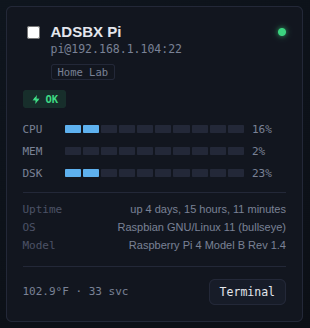
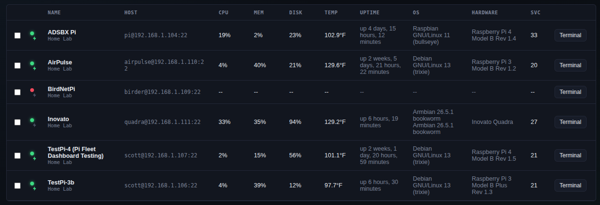
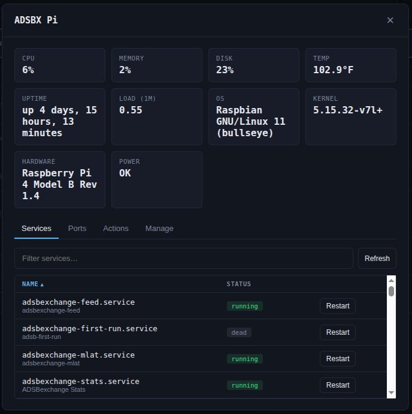
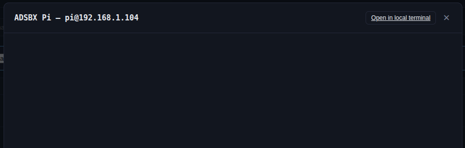

# PiOps

A self-hosted, agentless control panel for a fleet of Raspberry Pis (or any
SSH-reachable Linux box): live stats, service and open-port visibility, an
in-browser terminal, one-click reboot/restart/custom actions, alerting, and
Pi-specific health signals like under-voltage detection — with **nothing to
install on the monitored devices**. It reaches them the same way you already
do: over SSH.

<!--
  Screenshots go here once captured -- see docs/screenshots/README.md for
  exactly what to capture and suggested filenames. Once the files exist at
  these paths, these will render automatically on GitHub.
-->
<p align="center">
  <br/>
  <em>Card view — a fleet at a glance, including under-voltage/throttling status</em>
</p>

<details>
<summary>More screenshots (list view, detail drawer, terminal)</summary>
<br/>

<p align="center">
  <br/>
  <em>List view — the same fleet, dense-table style</em>
</p>
<p align="center">
  <br/>
  <em>Device detail drawer — stats, services, ports, and quick actions in one place</em>
</p>
<p align="center">
  <br/>
  <em>In-browser SSH terminal, no separate client needed</em>
</p>

</details>

## Why this instead of Grafana, Uptime Kuma, or Netdata?

Those are all good tools built for a different job. The honest comparison:

| | PiOps | Grafana + Prometheus | Netdata | Uptime Kuma |
|---|---|---|---|---|
| Agent required on each device | **No** — SSH only | Yes (node_exporter) | Yes (netdata agent) | No, but HTTP/TCP checks only |
| Fleet-wide system stats (CPU/mem/disk/temp) | Yes | Yes | Yes, in depth | No |
| Raspberry Pi under-voltage/throttling detection | **Yes** | No | No | No |
| Reboot / restart services / run commands | **Yes** | No | No | No |
| In-browser SSH terminal | **Yes** | No | No | No |
| Setup for a handful of Pis | One `npm install` or container | Prometheus + Grafana + an exporter per node | An agent per node (or their cloud) | Lightweight, but monitoring-only |

The short version: if you already have SSH access to your fleet (you do —
that's how you set them up), this needs nothing further installed on any of
them. Grafana/Prometheus and Netdata are more powerful for deep, long-running
metrics at scale, but that power comes with real setup cost that doesn't pay
off for a home-lab handful of Pis. Uptime Kuma is excellent at what it does
(is this reachable?) but doesn't touch system stats or let you act on what
it finds. This dashboard is aimed squarely at the space between "nothing" and
"a full observability stack": agentless, Pi-aware, and a control panel rather
than just a viewer.

## Features

- **Add / edit / remove devices** at any time from the UI (name, host, port, user, group, password or private-key auth)
- **CSV import** — bulk-add devices from a spreadsheet, with a downloadable template
- **Card or detail-table view** — toggle between visual cards and a dense, sortable-by-drag table
- **Drag to reorder** — rearrange devices in either view; order is remembered per browser
- **Live stats** — CPU, memory, disk, temperature, uptime, load average, running service count, OS version, and hardware model — polled over SSH every 15s and pushed to the browser over a websocket
- **Services tab** per device — full `systemctl` unit list with status, filterable
- **Ports tab** per device — open TCP ports via `ss`/`netstat`; recognized web ports (Grafana, Home Assistant, Node-RED, Plex, Jellyfin, and similar) are clickable links
- **Groups** — manage a curated list of group names in Settings; the Add/Edit device form uses a dropdown fed from that list
- **Alerts** — webhook notifications (Discord, Slack, ntfy.sh, or generic JSON) when a device goes offline/recovers, a Pi reports under-voltage or throttling, or CPU/memory/disk/temperature crosses a threshold you set
- **Under-voltage / throttling indicator** — reads `vcgencmd get_throttled` on Raspberry Pi devices and flags active or historical power/thermal issues right on the card
- **Fleet actions** — reboot, shut down, or start/stop/restart a specific service, all with a confirmation dialog; define your own custom quick commands in Settings that show up as buttons on every device
- **Bulk actions** — select multiple devices to assign a group, export to CSV, or delete them all at once
- **Docker support** — run it as a container instead of a native Node process; see [DOCKER.md](DOCKER.md), including specific steps for a Synology NAS
- **Update notifications** — an optional badge in the top bar when a newer version exists on your GitHub repo (informational only; see "Updating" in DOCKER.md or INSTALL.md)
- **Network scanning** — sweep your local subnet for hosts with SSH open and bulk-add whichever you select, using one shared username/credential for the batch
- **Optional password gate** — Settings → Security lets you put a single shared password in front of the whole dashboard; off by default
- **Mobile-friendly** — checking your fleet from a phone works: wrapping toolbars, scrollable tables instead of squished columns, and near-fullscreen modals on narrow screens
- **One-line installer** — `install.sh` handles Node.js, cloning, the dedicated system user, and the systemd service in one command; safe to re-run later as an update. `uninstall.sh` reverses it just as easily, with a confirmation prompt first
- **Light/dark theme** — Settings → General; defaults to dark
- **Automatic backups** — periodic server-side snapshots (Settings → Backup), encrypted with this install's own key, no passphrase to manage; on by default. A safety net against an accidental bulk delete, not a substitute for the manual export
- **In-browser SSH terminal** — click "Terminal" on any card for a real xterm.js session proxied over SSH
- **"Open in local terminal"** — hands off to your system's default `ssh://` handler, or launch PuTTY / WinSCP directly (pick one in Settings; see "Windows integration" below)
- **Settings** — Metric/Imperial and °C/°F display preference, view mode, local terminal app, saved per-browser
- **Encrypted backup export/import** — bundle every device (with credentials) and your preferences into one passphrase-protected file, portable across installs
- Credentials are **encrypted at rest** (AES-256-GCM) in the dashboard's own data file

## Requirements

- Node.js 18+ on whichever machine will run the dashboard (a dedicated always-on Pi, per your plan)
- SSH access (password or key) from that machine to each Pi you want to monitor
- The monitored Pis just need a normal SSH server — nothing else to install

## Setup

**Fastest path** (fresh Raspberry Pi OS/Debian/Ubuntu machine): one
command sets up Node.js if needed, clones this repo, creates a
dedicated system user, and installs it as a systemd service.

**Install:**
```bash
curl -sSL https://raw.githubusercontent.com/wy2c73/piops/main/install.sh | bash
```

**Upgrade** (same command -- safe to re-run, updates in place instead
of starting over):
```bash
curl -sSL https://raw.githubusercontent.com/wy2c73/piops/main/install.sh | bash
```

**Uninstall** (asks for confirmation before removing anything; see
[UNINSTALL.md](UNINSTALL.md) for what this does, the Docker
equivalent, and further optional cleanup):
```bash
curl -sSL https://raw.githubusercontent.com/wy2c73/piops/main/uninstall.sh | bash
```

See the comments at the top of `install.sh`/`uninstall.sh` for exactly
what each does and which environment variables let you customize the
install directory, service user, or port. Both are plain, readable
scripts under 200 lines -- reading one before running it is entirely
reasonable instead of piping straight to bash.

See [INSTALL.md](INSTALL.md) for detailed, step-by-step manual install
instructions including system and software requirements, if you'd
rather do it by hand or aren't on a Debian-family system. Short version:

```bash
cd backend
npm install
npm start
```

Prefer Docker? See [DOCKER.md](DOCKER.md) -- includes specific steps for
running this on a Synology NAS via Container Manager.

On startup it prints every LAN IP it's reachable on, e.g.:

```
PiOps listening on 0.0.0.0:3000
  -> http://localhost:3000
  -> http://192.168.1.50:3000
```

Open that `192.168.1.x` address from any device on your network — laptop, phone, etc.
It binds to all interfaces by default, so no extra config is needed for LAN access.

If you don't see it from another machine, it's almost always the Pi's firewall.
If you're running `ufw`:

```bash
sudo ufw allow 3000/tcp
```

By default it listens on port 3000 and polls every 15 seconds. Override with env vars:

```bash
PORT=8080 POLL_INTERVAL_MS=30000 POLL_CONCURRENCY=5 npm start
```

To restrict it to localhost only (e.g. if you're putting a reverse proxy in front of it), set `HOST=127.0.0.1`.

## Running it as a service (systemd)

So it survives reboots on your dedicated Pi:

```ini
# /etc/systemd/system/piops.service
[Unit]
Description=PiOps
After=network.target

[Service]
Type=simple
WorkingDirectory=/opt/piops/backend
ExecStart=/usr/bin/node server.js
Restart=on-failure
User=piops
Environment=PORT=3000

[Install]
WantedBy=multi-user.target
```

```bash
sudo cp -r piops /opt/piops
sudo useradd -r -s /usr/sbin/nologin piops
sudo chown -R piops:piops /opt/piops
cd /opt/piops/backend && sudo -u piops npm install --omit=dev
sudo systemctl enable --now piops
```

To watch what it's doing (or see the error if something's wrong):

```bash
sudo journalctl -u piops -f
```

This shows a live feed of the service's log output, updating in real
time as new lines come in. Press `Ctrl+C` to stop watching (this
doesn't stop the service, just the log view).

## Network scanning

"Scan network" in the toolbar sweeps a subnet (auto-detected from the
dashboard host, or enter your own CIDR) for hosts with an SSH port open --
a plain TCP connect check, so it works without root and without needing
raw sockets. It only checks whether the port responds; nothing is added
until you select which discovered hosts to add and supply credentials.
Since most home-lab fleets share one login, you provide a single
username/password-or-key for the whole batch rather than one at a time --
edit a device afterward if one of them actually needs different
credentials. Already-added devices show up grayed out in the results so
you don't accidentally create duplicates. Capped at /20 (1022 addresses)
to keep scan time reasonable; a full /24 typically finishes in a few
seconds.

## CSV device import

Settings &rarr; Import devices from CSV. Columns:

```
name,host,port,username,group,authType,secret,passphrase
```

`authType` is `password` or `key`; leave `port`, `group`, and `passphrase` blank
to use their defaults. For `key` auth, quote the `secret` field and keep the
private key's newlines inside the quotes (any spreadsheet app does this
automatically if you paste a multi-line value into a cell). Existing devices
(matched by host + port + username) are skipped, so it's safe to re-import
the same file. Download a template from the same Settings section.

## Making "Open in local terminal" actually open a terminal

"Open in local terminal" generates a link (`ssh://` by default, or
`putty:`/`sftp://` if you pick PuTTY/WinSCP in Settings) and hands it to
your OS. **On a fresh system, none of these do anything until you
register a handler for them** -- that's normal, out-of-the-box behavior
on both Windows and Linux, not something broken in the dashboard. A
website genuinely cannot launch a native application directly for
security reasons; a registered URL handler is the only mechanism the web
platform provides for this, and it has to be set up once per machine.

### Windows: System default -> Windows Terminal / Command Prompt

This is the option most people want: clicking the link opens a real
native terminal (Windows Terminal if installed, Command Prompt
otherwise) running the `ssh` client built into Windows 10 (1809+) and
Windows 11 -- nothing extra to install.

1. Copy `windows/ssh-protocol-handler.vbs` from this repo somewhere
   permanent, e.g. `C:\Tools\piops\`.
2. Open `windows/register-ssh-protocol.reg` in a text editor and replace
   the placeholder path with wherever you put the `.vbs` file in step 1.
3. Double-click the edited `.reg` file and confirm the prompt.

That's it -- Settings can stay on "System default." If something else on
your system already handles `ssh://` links, this silently replaces that
registration.

### Windows: PuTTY / WinSCP instead

If you'd rather use one of these specifically:

- **WinSCP** needs no extra setup — its installer registers `sftp://` /
  `scp://` links automatically (this is the default option when installing).
- **PuTTY** doesn't understand URLs on its own, so it needs the same kind
  of one-time setup as above:
  1. Copy `windows/putty-protocol-handler.vbs` from this repo somewhere
     permanent on the Windows machine, e.g. `C:\Tools\piops\`.
  2. Open `windows/register-putty-protocol.reg` in a text editor and replace
     the placeholder path with wherever you put the `.vbs` file in step 1.
  3. Double-click the edited `.reg` file and confirm the prompt.
  4. In the dashboard, go to Settings &rarr; set "Open in local terminal" to
     PuTTY.

Both PuTTY files assume it's installed at `C:\Program Files\PuTTY\putty.exe` —
edit the path in `putty-protocol-handler.vbs` if yours is elsewhere.

### Linux: System default -> your terminal emulator

See [linux/README.md](linux/README.md) for the equivalent setup --
registers `ssh://` links to open in whichever terminal emulator you have
(tries several common ones automatically). Verified end-to-end in this
repo's own CI-adjacent testing: the registration correctly resolves and
launches the parsed `ssh user@host -p port` command.

## Versioning

The current version is shown next to the dashboard's name in the top bar and
via `GET /api/version`. See [CHANGELOG.md](CHANGELOG.md) for release history.

## Troubleshooting

**`EADDRINUSE: address already in use 0.0.0.0:3000`** &mdash; something's
already listening on port 3000, most often a previous `node server.js`
that wasn't stopped, or the systemd service already running. Check
`sudo systemctl status piops` first; if that's active you
don't need to (and shouldn't) also run `npm start` manually. Otherwise
find and stop the other process: `sudo lsof -i :3000`, then `kill <PID>`.

**"Could not decrypt stored credential"** &mdash; `backend/data/.key` no
longer matches what encrypted the secrets in `backend/data/devices.json`.
This happens if one of those two files gets replaced or regenerated
without the other (they're a pair: losing the key means the secrets it
encrypted are unrecoverable by design, same as losing an encryption key
for any encrypted volume). As of 1.2.1 this only affects the specific
device(s) involved, not the whole server. To recover:
- If you have a backup export made *before* the mismatch (Settings &rarr;
  Export backup), delete `backend/data/devices.json` and
  `backend/data/.key`, restart the server (it generates a fresh key), then
  restore from that backup.
- Otherwise, remove the affected device(s) and re-add them with their
  credentials.

## Setting up alerts

In Settings, turn Alerts on, paste a webhook URL, and pick the matching format:

- **Discord**: Server Settings &rarr; Integrations &rarr; Webhooks &rarr; New Webhook &rarr; copy its URL
- **Slack**: create an "Incoming Webhook" app for your workspace &rarr; copy its URL
- **ntfy.sh**: no account needed &mdash; just pick a topic name and use `https://ntfy.sh/your-topic-name` (subscribe to that same topic in the ntfy app on your phone)
- **Generic**: any endpoint that accepts a POST with `{"title": "...", "message": "..."}` as JSON

Use "Send test alert" to confirm it's wired up correctly before relying on it.

The four thresholds (CPU/Memory/Disk/Temp) set in Settings are the
fleet-wide defaults. If one specific device needs a different number --
say, a Pi that always runs a bit hotter, or one that's normally low on
disk -- open its Add/Edit device form and expand "Alert threshold
overrides." Leave any of the four blank to keep using the global default;
set one to give that device its own value instead. Everything else about
alerting (on/off, webhook, which event types are enabled) stays global.

## Setting up quick actions

Reboot, Shutdown, starting/stopping/restarting a service, and custom
commands all run over the same SSH connection as everything else, using
`sudo -n` (non-interactive sudo -- it fails immediately with a clear
error instead of hanging if a password would actually be required). For
these to work, add a sudoers
rule on each device you want to control, scoped to only what you need:

```bash
# On the monitored Pi, run: sudo visudo -f /etc/sudoers.d/piops
# and add a line like this (replace "pi" with the account this dashboard uses):
pi ALL=(ALL) NOPASSWD: /usr/sbin/reboot, /usr/sbin/shutdown, /usr/bin/systemctl restart *, /usr/bin/systemctl start *, /usr/bin/systemctl stop *
```

Widen or narrow that list to match what you actually want this account able
to do. Custom commands you define in Settings need whatever sudo access
their own command line requires -- add rules for those specifically rather
than granting blanket `NOPASSWD: ALL`, which would let anything reachable
through this dashboard run as root unrestricted.

Without a matching sudoers rule, these actions will fail with a clear
"a password is required" error rather than hanging -- that's expected until
you add the rule above.

**Long-running commands** (package upgrades, etc.): custom commands default
to a 120-second timeout, but you can set any value up to 30 minutes when
creating one in Settings. A command like
`sudo -n apt-get update && sudo -n DEBIAN_FRONTEND=noninteractive apt-get -y upgrade`
can genuinely take several minutes on a Pi -- set the timeout accordingly, and
keep the browser tab open until it finishes; the Actions tab's output panel
shows the exit code and full stdout/stderr once it completes (or a clear
timeout error if it ran past the limit you set).

## How it works

- `backend/lib/ssh.js` opens a short-lived SSH connection per poll, runs a single
  compact shell script that prints hostname/uptime/load/mem/disk/temp/service-count,
  and parses the output. One connection per device per poll cycle, not one per metric.
- `backend/poller.js` runs that on an interval (default 15s) for every registered
  device, with a concurrency cap so a big fleet doesn't open dozens of SSH sessions
  at once. Results are cached in memory and pushed to connected browsers over
  `/ws/stats`.
- `backend/wsTerminal.js` opens a real interactive SSH shell (`conn.shell()`) per
  terminal session and proxies bytes between it and an xterm.js instance in the
  browser over `/ws/terminal?id=<deviceId>`.
- `backend/lib/store.js` + `backend/lib/crypto.js` persist devices to
  `backend/data/devices.json`, with passwords/private keys encrypted using a
  locally-generated key at `backend/data/.key` (mode 600). Back up or protect that
  directory the way you would `~/.ssh`.
- The frontend (`frontend/`) is plain HTML/CSS/JS — no build step — so it runs
  directly on a Pi without a Node toolchain for the client side.

## Security notes

- This dashboard has standing SSH credentials to your whole fleet. Run it behind
  your own network/firewall. It now has an optional single-password gate
  (Settings &rarr; Security, off by default &mdash; see "Setting up the password
  gate" below), but that's a basic deterrent against casual/unintended LAN
  access, not a substitute for a real security boundary. If you need to expose
  it beyond your LAN, put it behind a reverse proxy with its own auth (e.g.
  Caddy/nginx) or a VPN like Tailscale/WireGuard rather than opening it to the
  internet directly.
- Consider creating a dedicated low-privilege SSH user on each Pi for monitoring,
  rather than using a root/admin account, if all you need is read-only stats. The
  service-listing and stat commands don't require root. The terminal feature will
  of course only be as privileged as the account you configure.
- Private keys pasted into the "Add device" form are encrypted before being written
  to disk, but they do pass through the browser and this server's memory in
  plaintext during that request — same trust model as pasting them into any admin
  tool you self-host.
- Reboot/shutdown/service-restart/custom-command actions mean anyone with access
  to this dashboard can run whatever those sudoers rules and custom commands
  allow, on every device with a matching entry. This is unchanged in spirit from
  the terminal feature (both ultimately run as whatever the SSH account can do)
  &mdash; worth turning the password gate on if you're not the only one with LAN
  access, and worth a VPN/reverse-proxy setup rather than a bare port-forward if
  you ever want to reach this away from home.
- The password gate's session cookie is sent in plain HTTP unless you put a TLS
  reverse proxy in front of this yourself &mdash; it isn't marked `Secure`, since
  that would silently break login for the common case of running this over plain
  HTTP on a LAN. Treat it accordingly if you do expose this beyond a trusted network.

## Setting up the password gate

Off by default so upgrading doesn't suddenly lock you out. To turn it on: Settings
&rarr; Security &rarr; On, enter a password (8+ characters), Save. From then on,
anyone opening the dashboard sees a login page first, and a "Log out" button
appears in the top bar. To change the password later, enter your current
password plus a new one and save; to turn it off, switch back to Off and confirm
with your current password.

This is a single shared password, not a user-account system &mdash; there's no
separate login per person, and no audit trail of who did what. It's meant to
keep the dashboard from being casually reachable by anyone else on your LAN
(a housemate, a guest on the WiFi, another device that gets compromised), not
to be a complete access-control solution on its own.

## Running tests

```bash
cd backend
npm test
```

Uses Node's built-in test runner (no extra dependency). Covers the
backend API end-to-end against the real Express app (devices, groups,
alerts, backup export/import including the legacy pre-rename format,
and the auth/session gate), plus the trickier pieces of logic that have
actually had real bugs before (CIDR parsing, version comparison, and
`install.sh`'s URL-parsing -- that last one is extracted and sourced
directly from the real file, not a separate copy, so it can't silently
drift from what the script actually does).

What it deliberately doesn't cover: actual SSH to a real device, or
anything needing a real browser (the mobile layout and modal-scroll
fixes, for instance) -- those still need the kind of manual,
real-environment testing used throughout this project's development.
Tests use an isolated temp data directory (`PIOPS_DATA_DIR`), so running
them never touches your real device registry.

## What's next

This now covers device management (including network scanning), live stats,
service/port visibility, SSH terminals, alerting, Pi-specific health signals,
fleet actions, Docker deployment, update notifications, and an optional
password gate. The main thing still on the table if you want it later:
historical charts (persisting stats to disk/SQLite instead of memory-only,
for real trend lines instead of just the current snapshot).

## License

[MIT](LICENSE)
